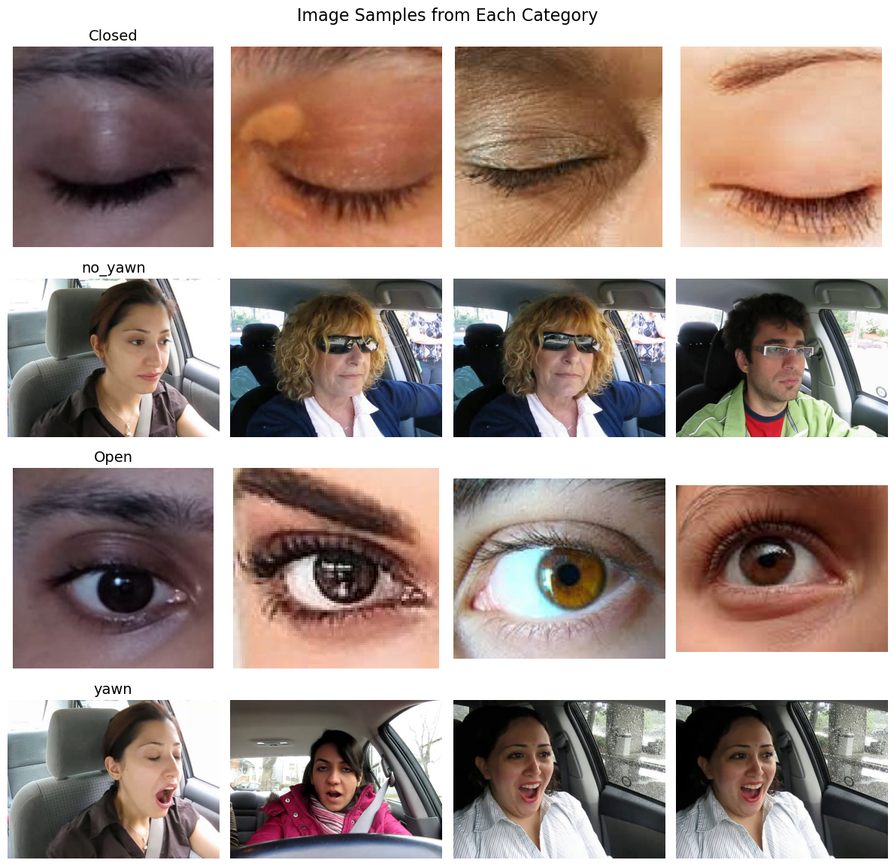
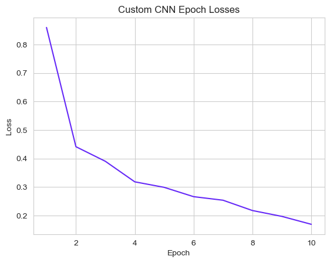
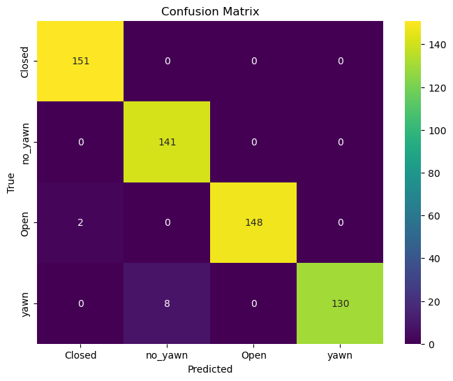
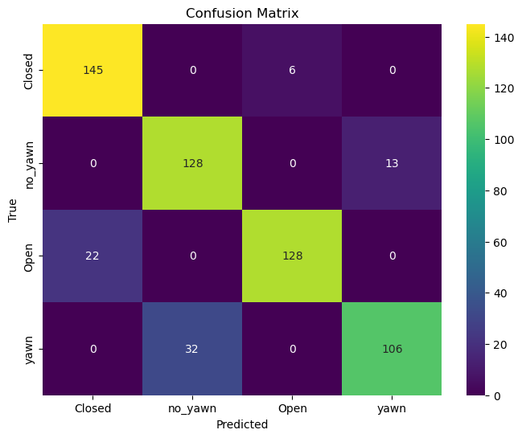

# Driver Drowsiness Detection using Deep Learning

This project aims to detect drowsiness using computer vision techniques. It utilizes PyTorch, OpenCV, and Haar Cascade for face detection. Ensemble learning is implemented using AlexNet and VGG16 models to enhance accuracy and performance.

## Dataset

## Features

    Drowsiness detection using computer vision
    Face detection using Haar Cascade classifier
    Ensemble learning with AlexNet and VGG16 models
    PyTorch for deep learning implementation
    OpenCV for image processing and manipulation

## Ensemble Learning

Ensemble learning is employed to combine the predictions from multiple models to improve the accuracy and robustness of the drowsiness detection system. In this project, we utilize the AlexNet and VGG16 models for ensemble learning.

**AlexNet**
AlexNet is a deep convolutional neural network architecture that gained prominence by winning the ImageNet Large Scale Visual Recognition Challenge in 2012. It consists of eight layers, including five convolutional layers and three fully connected layers. By incorporating AlexNet into the ensemble, we leverage its ability to extract hierarchical features from input images.

**VGG16**
VGG16 is another widely used convolutional neural network architecture that achieved high accuracy on the ImageNet challenge. It has 16 layers, including 13 convolutional layers and three fully connected layers. VGG16 is known for its simplicity and effectiveness in capturing complex image patterns.

**Custom CNN**
The custom CNN architecture consists of two main parts: the feature extraction part and the classification part. In the feature extraction part, two convolutional layers with ReLU activation and max pooling are applied to extract meaningful features from the input images. These layers learn to detect various patterns and structures in the images. The output of the feature extraction part is then flattened and fed into the classification part, which consists of two fully connected layers with ReLU activation. These layers learn to map the extracted features to the target classes. The final layer produces the output probabilities for each class. Overall, the architecture leverages convolutional layers for feature extraction and fully connected layers for classification, enabling the model to learn and make predictions on the given drowsiness detection task.

The predictions from each model are averaged to obtain the final prediction. By combining the outputs of multiple models, we aim to leverage the diverse representations and learn more comprehensive patterns for accurate drowsiness detection.

## Evaluation

**Alexnet Model**

**Custom Model**

